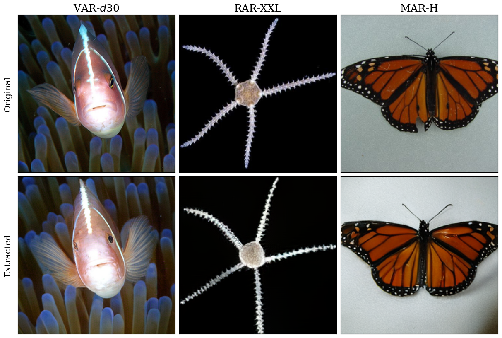

# Privacy Attacks on Image AutoRegressive Models

[](https://arxiv.org/abs/2502.02514)

## Abstract

Image AutoRegressive generation has emerged as a new powerful paradigm. Specifically, image autoregressive models (IARs) surpass state-of-the-art diffusion models (DMs) in both image quality (FID: 1.48 vs. 1.58) and generation speed. However, the privacy risks associated with IARs remain unexplored, raising concerns regarding their responsible deployment. To address this gap, we conduct a comprehensive privacy analysis of IARs with respect to DMs, which serve as reference points. We develop a novel membership inference attack (MIA) that achieves an exceptionally high success rate in detecting training images (with a TPR@FPR=1\% of 86.38\% vs. 4.91\% for DMs). We leverage our novel MIA to provide dataset inference (DI) for IARs, which requires as few as 6 samples to detect dataset membership (compared to 200 for DI in DMs). Finally, we reconstruct hundreds of training data points from an IAR (e.g., 698 from VAR-d30). Our results demonstrate a fundamental privacy-utility trade-off: while IARs excel in image generation quality and speed, they are also significantly more vulnerable to privacy attacks compared to DMs. This trend suggests that utilizing techniques from DMs within IARs, such as modeling the per-token probability distribution using a diffusion procedure, can potentially help to mitigate the vulnerability of IARs to privacy attacks.



## Requirements
PDM package manager can be installed as described on [its website](https://pdm-project.org/en/latest/).

In order to setup the project run the following commands:
```bash
pdm install
git clone https://github.com/FoundationVision/VAR
git clone https://github.com/LTH14/mar
git clone https://github.com/bytedance/1d-tokenizer
git clone https://github.com/facebookresearch/audiocraft
git submodule update --init --recursive
mv 1d-tokenizer rar
```

Also, change `from models.diffloss import DiffLoss` to `from mar.models.diffloss import DiffLoss` in `mar/models/mar.py`.

In case of GBLICXX import error run `export LD_LIBRARY_PATH=$LD_LIBRARY_PATH:[YOUR_PATH_TO_CONDA]/envs/iars_priv/lib` (based on [this](https://stackoverflow.com/a/71167158))

## Downloading models

The scripts will download the models by themselves.

## Downloading data and data preparation

* ImageNet: Download [train](https://academictorrents.com/details/a306397ccf9c2ead27155983c254227c0fd938e2) and [validation](https://academictorrents.com/details/5d6d0df7ed81efd49ca99ea4737e0ae5e3a5f2e5) ImageNet LSVRC 2012 splits.

## Downloading figaro models and data

Follow the README located in figaro submodule.

## Running Membership Inference

For each model, run
```bash
pdm run python3 -u main.py +attack=$attack +model=$model +dataset=$dataset_name +dataset.split=$split
```
Substitute `$split` with `train` and `val`. For attacking VAR and RAR set `attack=llm_mia_cfg`, and for MAR: `llm_mia_loss`. Substitute `$dataset_name` with `imagenet` for image-generating models and with `audiocaps` and `lakhmidi` for audiocraft and figaro models respectively.

Then, run `analysis/mia_performance.py` (or `analysis/mia_performance_audio.py` for audio models) to obtain TPR@FPR=1% for all IARs. The results will be in the `analysis/plots/mia_performance` folder.

## Running Dataset Inference

Run `analysis/di.py` (for audio models use `analysis/di_audio.py` or `analysis/di_codebooks.py` for attack utilising audiocraft model codebooks). This script will output results of DI on IARs to `analysis/plots/di/di_results.csv`

## Data Extraction

### Candidates selection
```bash
for model in var_30 rar_xxl
do
    for idx in {0..8}
    do
        pdm run python3 -u main.py +attack=mem_info +model=$model +dataset=imagenet +dataset.split=train cfg.run_id=1M_${idx} cfg.n_samples_eval=140000 +dataset.gpu_cnt=8 +dataset.gpu_idx=$idx
    done
done
for model in mar_h
do
    for idx in {0..8}
    do
        pdm run python3 -u main.py +attack=mem_info_mar +model=$model +dataset=imagenet +dataset.split=train cfg.run_id=1M_${idx} cfg.n_samples_eval=140000 +dataset.gpu_cnt=8 +dataset.gpu_idx=$idx
    done
done
```
We suggest running these in a disributed GPU environment. The scripts are paralelizable.

### Audio candidates selection

```bash
pdm run python -u main.py +attack=mem_info +model=$model +dataset=$dataset_name +dataset.split=train
```

### Generation

```bash
for model in var_30 rar_xxl mar_h
do
    pdm run python3 -u main.py +attack=gen_memorized +model=$model +dataset=imagenet +dataset.split=train
done
```

### Audio generation

```bash
pdm run python -u main.py +attack=$attack +model=$model +dataset=$dataset_name +dataset.split=train
```

Substitute `$attack` with `gen_memorized_audio` for audiocraft models and `gen_memorized_figaro` for figaro model.

### Assesment

```bash
for model in var_30 rar_xxl mar_h
do
    pdm run python3 -u main.py +attack=find_memorized +model=$model +dataset=imagenet +dataset.split=train
done
```

### Audio assesment

```bash
pdm run python -u main.py +attack=$attack +model=$model +dataset=$dataset_name +dataset.split=train
```

Substitute `$attack` with `find_memorized_audio` for audiocraft models and `find_memorized_figaro` for figaro model.

### Assesment results

Finally, a `{model}_memorized_train.csv` will be obtained in `analysis/plots/memorization`.

## Citation

If you found our work helpful, please cite us using the following BiBTex:
```
@misc{kowalczuk2025privacyattacksimageautoregressive,
      title={Privacy Attacks on Image AutoRegressive Models},
      author={Antoni Kowalczuk and Jan Dubiński and Franziska Boenisch and Adam Dziedzic},
      year={2025},
      eprint={2502.02514},
      archivePrefix={arXiv},
      primaryClass={cs.CV},
      url={https://arxiv.org/abs/2502.02514},
}
```
